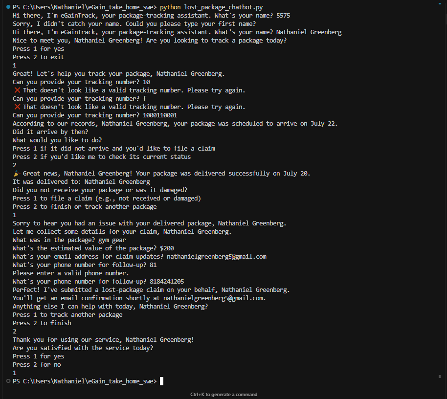

# eGainTrack - Package Tracking Chatbot

A command-line chatbot that helps users track packages and file claims for lost/delayed items. 

## Author

**Nathaniel Greenberg** - eGain Take Home Assignment

## Features

- **Personalized Experience**: Collects and uses user's name throughout the conversation
- **Smart Package Tracking**: Determines package status based on tracking number patterns
- **Comprehensive Claim Filing**: Collects detailed information (contents, value, contact details)
- **Flexible Status Handling**: Supports delivered, delayed, and lost package scenarios
- **Robust Error Handling**: Validates all inputs with clear error messages and re-prompting
- **Satisfaction Survey**: Collects feedback and provides customer support escalation
- **Multi-Session Support**: Users can track multiple packages in one session

## Setup/Installation Instructions

### Prerequisites
- Python 3.6 or higher
- No additional dependencies required (uses only Python standard library)

### Installation Steps

1. **Clone or download the project**
   ```bash
   # If using git
   git clone <repository-url>
   cd eGain_take_home_swe
   
   # Or simply download the lost_package_chatbot.py file
   ```

2. **Run the chatbot**
   ```bash
   python lost_package_chatbot.py
   ```

3. **Start the conversation**
   - Enter your name when prompted
   - Choose whether to track a package
   - Follow the menu-driven conversation flow

### Testing Different Scenarios

The chatbot uses the last digit of tracking numbers to determine package status:

- **Last digit 0-3**: Package delivered successfully
- **Last digit 4-6**: Package delayed but found
- **Last digit 7-9**: Package lost/not found

**Example tracking numbers for testing:**
- `1234567890` → Delivered successfully
- `1234567894` → Delayed
- `1234567897` → Lost

## Approach Explanation

This chatbot was designed with a human-centered, decision-tree approach to make package tracking and claim filing as seamless and empathetic as possible. From the start, the bot personalizes the experience by using the user's name throughout the conversation, and guides users with a clear, menu-driven interface that makes navigation easy. Information is revealed progressively, so users are never overwhelmed, and contextual details—like the scheduled delivery date—are provided before asking for decisions. The flow is flexible, allowing users to file claims even for packages marked as delivered, which reflects real-world scenarios. There are multiple entry points, so users can file a claim directly or check the status first, and escalation paths are always available if human support is needed. The conversation is designed to feel natural and empathetic, acknowledging user frustration and offering solutions, while confirmation steps and a satisfaction survey ensure users feel heard and supported.

On the technical side, the code is organized into modular functions, each handling a specific part of the conversation, such as input validation, claim collection, or status checking. State is managed with simple variables, and all user inputs are validated with clear, helpful error messages. The last-digit logic for tracking numbers makes it easy to test all conversation paths predictably. Error handling is proactive, with the bot validating inputs before processing, providing specific feedback when something goes wrong, and re-prompting users until valid input is received. The design ensures that the chatbot never crashes, even when faced with unexpected input, and users can track multiple packages in a single session. Overall, the approach balances user experience, technical robustness, and real-world flexibility.

## Usage Examples




## Conversation Flowchart

A visual flowchart of the chatbot conversation is attached as `flowchart.png` in this repository. If you would like to take a look, simply open the image file.

If you find the image blurry or want to generate a higher-resolution version, you can easily regenerate it using the Mermaid source file `flowchart.mmd` with the following command:

```bash
mmdc -i flowchart.mmd -o flowchart.png
```

This will create a new `flowchart.png` with the latest flowchart. You can also view or edit the flowchart using the [Mermaid Live Editor](https://mermaid.live/).


